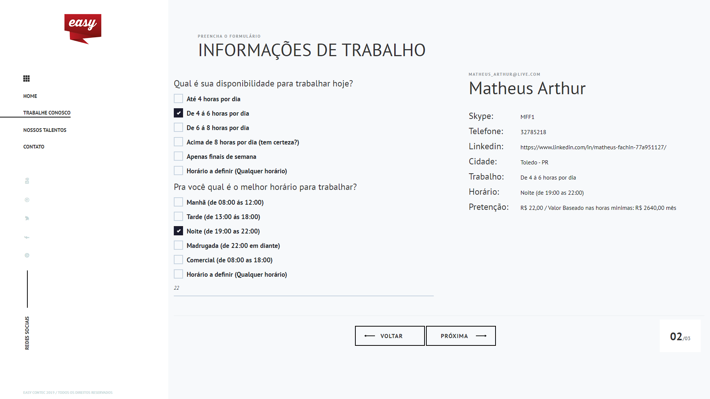

Estrutura do projeto: 
- DAL
- BLL
- MVC5
- EntityFramework6

Frontend: 
- HTML 
- CSS 
- JQuery
- AngularJS
- Bootstrap (Com várias alterações de frontend para dar foco em minhas habilidades de modificação de layout). 

Ferramentas:
- PowerDesigner

Convenções/Metodologias:

1 - Criação de banco

Foi usado a convenção: https://github.com/ktaranov/sqlserver-kit/blob/master/SQL%20Server%20Name%20Convention%20and%20T-SQL%20Programming%20Style.md para desenvolver o banco de dados da aplicação.

2 - Convenção para escrita em C#

Para a nomenclatura das variáveis e classes utilizei a convenção: 
https://github.com/ktaranov/naming-convention/blob/master/C%23%20Coding%20Standards%20and%20Naming%20Conventions.md

3 - Implementação de Repository 

Estrutura e padrões usados para a criação do repository: https://www.dotnetcurry.com/aspnet-mvc/1155/aspnet-mvc-repository-pattern-perform-database-operations

4 - Services AngularJS 

Foi utilizado um modelo do Github para a organização da parte AngularJS: https://github.com/qmmughal/AngularJsMVC

6 - para as transações utilizei o EF6

https://docs.microsoft.com/en-us/ef/ef6/saving/transactions

Imagens Obs: Não coloquei a aba network em todos os prints pois quero dar foco no layout do sistema, mas criei uma pasta com todos os prints com a aba network aberta (/printsNetwork)

Tela inicial

Listagem de candidatos

Cadastrando página 1

Cadastrando página 2

Cadastrando página 3

Confirmar dados cadastrados

Editar candidato cadastrado

Deletar candidato cadastrado

